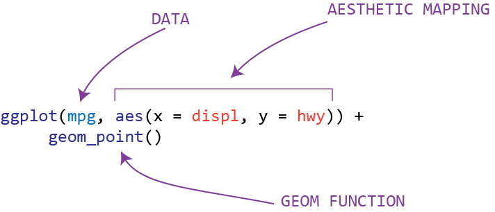

```{r 02-load-libraries, include=FALSE}
library(ggplot2)
library(tidyverse)
```

# First Steps

## General Housekeeping Items

- This is a learning opportunity so feel free to ask any question at any time.
- Take time to learn the theory, in particular Grammar of Graphics.
- Please do the chapter exercises.  Second-best learning opportunity!
- Please plan to facilitate one of the discussions.  Best learning opportunity!

---

## Learning Objectives

- Brief introduction to ggplot's capabilities
- Learn about key components of every plot: data, aesthetics, geoms
- Learn about faceting
- See a few different geoms
- Modify the axes
- Save the plot to disk

---

## Main data set

For this chapter, we'll mainly use the `mpg` dataset that comes with `ggplot`.

```{r 02-inspect-mpg-dataset}
mpg
```

- `cty` and `hwy` are miles per gallon measures
- `displ` is engine displacement in litres
- `drv` is front wheel (f), rear wheel (r) or four wheel (4)
- `model` is the model of the car
- `class` is two-seater, SUV, compact, etc.


---

## Components of every plot


```{r 02-plot-mpg}
ggplot(mpg, aes(x = displ, y = hwy)) +
  geom_point()
```

It's allowable to omit the `x =` and `y =` arguments of `aes`.  In other words, `aes(displ, hwy)` would be valid for this plot.

---

## A few exercises

- What does the below plot show?  Is it useful?  How could it improve?

```{r 02-a-few-exercises}
ggplot(mpg, aes(model, manufacturer)) + 
  geom_point() +
  theme(axis.text.x = element_text(angle = 90, hjust = 1))
```
- Practice coding the following plots.  Anticipate what the output will look like.  Become familiar with the common components of the plots.
```{r 02-scatterplot-with-mpg}
ggplot(mpg, aes(cty, hwy)) + 
  geom_point()
```

```{r 02-scatterplot-with-diamonds}
ggplot(diamonds, aes(carat, price)) + 
  geom_point()
```

```{r 02-scatterplot-with-economics}
ggplot(economics, aes(date, unemploy)) + 
  geom_line()
```

```{r 02-histogram-with-mpg, message=FALSE}
ggplot(mpg, aes(cty)) + 
  geom_histogram()
```


---

## Other aesthetic attributes

- color, shape and size can be mapped to variables in the data


The `class` variable of the `mpg` dataset has seven unique values.  The plot can assign a specific color to each value by mapping `class` to color _within_ the aesthetic function.
```{r 02-distinct-class, echo= FALSE}
mpg %>% distinct(class)
```


```{r 02-scatterplot-with-color}
ggplot(mpg, aes(displ, hwy, color = class)) +
  geom_point()
```


Including a color assignment _outside_ the aesthetic of the _geometry_ layer will make all of the points that color.

```{r 02-color-outside-aes}
ggplot(mpg, aes(displ, hwy)) +
  geom_point(color = "blue")
```


Mapping a variable to `shape` and `color` adds some diversity and information to the plot.

```{r 02-mapping-shape-and-color}
ggplot(mpg, aes(displ, hwy, shape = drv, color = drv)) + 
  geom_point()
```


Mapping a variable to `size` can also add some new insights.

```{r 02-mapping-size}
ggplot(mpg, aes(manufacturer, drv, size = displ)) +
  geom_point() +
  theme(axis.text.x = element_text(angle = 90))
```

---

## Faceting

Faceting creates graphics by splitting the data into subsets and displaying the same graph for each subset.  Really helpful if there are lots of values, making color/shape less meaningful.

```{r 02-faceting-intro}
ggplot(mpg, aes(displ, hwy)) +
  geom_point() +
  facet_wrap(~class)
```

Exercise: Use faceting to explore the three-way relationship between fuel economy, engine size and number of cylinders.  How does faceting by number of cylinders change your assessment of the relationship between engine size and fuel economy?

**NOT FACETED BY `cyl`**
```{r 02-not-faceted}
ggplot(mpg, aes(displ, hwy)) +
  geom_point()
```

**FACETED BY `cyl`**
```{r 02-faceted}
ggplot(mpg, aes(displ, hwy)) +
  geom_point() +
  facet_wrap(~cyl)
```

## Geoms

The `geom_point()` geom gives a familiar scatterplot.

Other `geoms` include:


- `geom_smooth()` which fits a smooth line to the data

  - check `help` to see `geom_smooth`'s arguments like `method`, `se` or `span`.
```{r 02-geom-smooth-example, message=FALSE}
ggplot(mpg, aes(displ, hwy)) +
  geom_point() +
  geom_smooth()
```

- `geom_boxplot()` which generates a box-and-whisker plot

  - check `help` to see `geom_boxplot`'s arguments like `outlier` arguments, and `coef` which adjusts the whisker length.
  
```{r 02-geom-boxplot-example}
ggplot(mpg, aes(drv, hwy)) +
  geom_boxplot()
```

  - consider boxplot variants like `geom_jitter` and `geom_violin`
```{r 02-geom-jitter-and-geom-violing-examples}
ggplot(mpg, aes(drv, hwy)) +
  geom_jitter()

ggplot(mpg, aes(drv, hwy)) +
  geom_violin()
```

- `geom_histogram` which generates a histogram and `geom_freqpoly` which generates a frequency polygon
  - check `help` to see `geom_histogram`'s arguments like `position` and `binwidth`.
  
```{r 02-geom-histogram-and-geom-freqpoly-example}
ggplot(mpg, aes(hwy)) +
  geom_histogram()

ggplot(mpg, aes(hwy)) +
  geom_freqpoly()
```
  
- `geom_bar` which generates a bar chart
  - check `help` to see `geom_bar`'s arguments like `position` and `width`

```{r 02-geom-bar-example}
ggplot(mpg, aes(manufacturer)) +
  geom_bar()
```

We'll take a second here to talk about the `stat` argument.  Note that in the first bar chart, the y-axis shows the number of observations labeled as `count`.

```{r 02-stat-intro}
mpg %>% group_by(manufacturer) %>% count()
```

What if you wanted to sum a certain value for each manufacturer, then you have to tell ggplot "don't just return the number of observations, add up the values in this certain column".  You do this using the `stat` argument and by specifying a new variable for the y-axis.  For instance, we might be interested in knowing the total price of all vehicles in the data set for each manufacturer.  It may be interesting to see if four Land Rovers are more expensive than 14 Hyundais.  (No disrepect to Hyundai drivers...  I am one myself!)  Unfortunately, price isn't a variable in this dataset so, let's use `displ` instead.  The sum of `displ` isn't particularly meaningful in real life, but it illustrates the use of the `stat` argument.

This graph below uses `displ` for `y` in the aesthetic and uses the `stat` of `identity` so that it sums the total displacement for each manufacturer.
```{r 02-stat-identity}
ggplot(mpg, aes(manufacturer, displ)) +
  geom_bar(stat = "identity")
```

This plot now shows the total displacement.

```{r 02-stat-identity-table}
mpg %>% group_by(manufacturer) %>% summarize(sum(displ))
```


- `geom_line` and `geom_path` which generates a line chart or path chart (useful for time series data)
  - check `help` to see `geom_line`'s arguments like `lineend` and `arrow`
  
```{r 02-geom-line-and-geom-path-examples}
ggplot(economics, aes(date, unemploy / pop)) +
  geom_line()

ggplot(economics, aes(date, uempmed)) +
  geom_line()
```
  
  To investigate these plots further, we can draw them on the same plot.
  
```{r 02-same-plot}

year <- function(x) as.POSIXlt(x)$year + 1900


ggplot(economics, aes(unemploy / pop, uempmed)) +
  geom_path(color = "grey50") +
  geom_point(aes(color = year(date)))
```
  
## Modifying the Axes

- `xlab()` and `ylab()` modify the axis labels

```{r 02-modifying-axes}
ggplot(mpg, aes(cty, hwy)) +
  geom_point(alpha = 1/3)

ggplot(mpg, aes(cty, hwy)) +
  geom_point(alpha = 1/3) +
  xlab("city driving (mpg)") +
  ylab("highway driving (mpg)")

# remove labels with NULL
ggplot(mpg, aes(cty, hwy)) +
  geom_point(alpha = 1/3) +
  xlab(NULL) +
  ylab(NULL)
```


- `xlim()` and `ylim()` modify the limits of the axes (boundaries)
```{r 02-modifying-limits}
ggplot(mpg, aes(drv, hwy)) +
  geom_jitter(width = 0.25)

ggplot(mpg, aes(drv, hwy)) +
  geom_jitter(width = 0.25) +
  xlim("f", "r") +
  ylim(20, 30)
```

##  Output

- Save the plot to a variable
```{r 02-output-to-variable}
p <- ggplot(mpg, aes(displ, hwy, color = factor(cyl))) +
  geom_point()
```

- Then print it
```{r 02-printing-plot}
print(p)
```

- Save it to disk
```{r 02-saving-plot-to-disk-}
ggsave("plot.png", p, width = 5, height = 5)
```

- Describe its structure
```{r 02-plot-structure}
summary(p)
```

