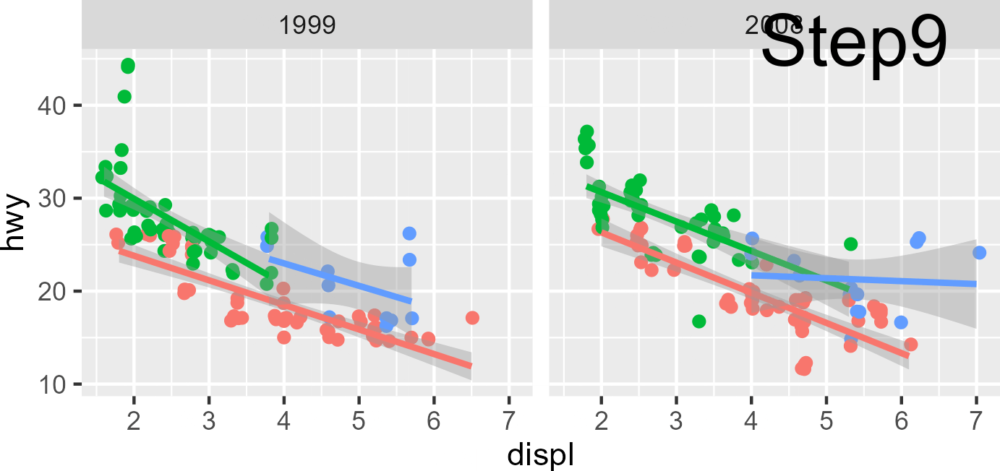

# ggplot internals

**Learning Objectives**

- What is the difference between user-facing code and internal code?
- What is the distinction between `ggplot_build()` and `ggplot_gtable()`?
- What the division of labor between `{ggplot2}` and `{grid}`?
- What is the basic structure of/motivation for ggproto?

```{r 20-01, message=FALSE}
library(ggplot2)
library(ggtrace) # remotes::install_github("yjunechoe/ggtrace")

library(purrr)
library(dplyr)
```

#### Introduction (the existence of internals)

The **user-facing code** that _defines_ a ggplot on the surface is not the same as the **internal code** that _creates_ a ggplot under the hood. In this chapter, we'll learn about how the internal code operates and develop some intuitions about thinking about the internals, starting with these two simple examples of mismatches between surface and underlying form:

#### Case 1: Order

You can change the order of some "layers" without change to the graphical output.

For example, `scale_*()` can be added anywhere and always ends up applying for the whole plot:

```{r 20-02, fig.show='hold', out.width='50%'}
ggplot(mtcars, aes(mpg, hp, color = as.factor(am))) +
  scale_x_log10() + #< scale first
  geom_point() +
  geom_smooth()

ggplot(mtcars, aes(mpg, hp, color = as.factor(am))) +
  geom_point() +
  scale_x_log10() + #< scale middle
  geom_smooth()
```

Though the order of `geom_*()` and `stat_*()` matters for order of drawing:

```{r 20-03, fig.show='hold', out.width='50%'}
ggplot(mtcars, aes(mpg, hp, color = as.factor(am))) +
  geom_point() +
  geom_smooth(fill = "black")

ggplot(mtcars, aes(mpg, hp, color = as.factor(am))) +
  geom_smooth(fill = "black") +
  geom_point()
```

#### Case 2: Modularity

We know that user-facing "layer" code that we add to a ggplot with `+` are stand-alone functions:

```{r 20-04}
lm_smooth <- geom_smooth(method = "lm", formula = y ~ x)
lm_smooth
```

When we add this object to different ggplots, it _materializes_ in different ways:

```{r 20-05}
ggplot(mtcars, aes(mpg, hp)) +
  lm_smooth

ggplot(mtcars, aes(wt, disp)) +
  lm_smooth
```

## The `plot()` method

The user-facing code and internal code is also separated by _when_ they are evaluated. The user-facing code like `geom_smooth()` is evaluated immediately to give you a ggplot object, but the internal code is only evaluated when a ggplot object is printed or plotted, via `print()` and `plot()`.

The following code simply creates a ggplot object from user-facing code, and **DOES NOT** print or plot the ggplot (yet).

```{r 20-06}
p <- ggplot(mpg, aes(displ, hwy, color = drv)) + 
  geom_point(position = position_jitter(seed = 2022)) +
  geom_smooth(method = "lm", formula = y ~ x) + 
  facet_wrap(vars(year)) + 
  ggtitle("A plot for expository purposes")
```

The ggplot object is actually just a list under the hood:

```{r 20-07}
class(p)
typeof(p)
```

Evaluating the ggplot is what gives you the actual points, rectangles, text, etc. that make up the figure (and you can also do so explicitly with `print()`/`plot()`)

```{r 20-08}
p
# print(p)
# plot(p)
```

These are two separate processes, but we often think of them as one monolithic process:

```{r 20-09, message=FALSE, fig.show='hide'}
defining_benchmark <- bench::mark(
  # Evaluates user-facing code to define ggplot,
  # but does not call plot/print method
  p <- ggplot(mpg, aes(displ, hwy, color = drv)) + 
    geom_point(position = position_jitter(seed = 2022)) +
    geom_smooth(method = "lm", formula = y ~ x) + 
    facet_wrap(vars(year)) + 
    ggtitle("A plot for expository purposes")
)

plotting_benchmark <- bench::mark(
  # Plots the ggplot
  plot(p)
)

bind_rows(
  defining_benchmark[,2:5],
  plotting_benchmark[,2:5]
)
```

The plot that gets rendered from a ggplot object is actually a **side effect** of evaluating the ggplot object:

```{r 20-10}
# Same as ggplot2:::print.ggplot
ggplot2:::plot.ggplot
```

The above code can be simplified to this:

```{r 20-11}
ggprint <- function(x) {
  data <- ggplot_build(x)
  gtable <- ggplot_gtable(data)
  grid::grid.newpage()
  grid::grid.draw(gtable)
  return(invisible(x)) #< hence "side effect"
}

ggprint(p)
```

Roughly put, you first start out as the ggplot object, which then gets passed to `ggplot_build()`, result of which in turn gets passed to `ggplot_gtable()` and finally drawn with `{grid}` 

```{r 20-12}
library(grid)
grid.newpage() # Clear display
p %>% 
  ggplot_build() %>%  # 1. data for each layer is prepared for drawing
  ggplot_gtable() %>% # 2. drawing-ready data is turned into graphical elements
  grid.draw()         # 3. graphical elements are converted to an image
```

At each step, you get closer to the low-level information you need to draw the actual plot

```{r 20-13}
obj_byte <- function(x) {
  scales::label_bytes()(as.numeric(object.size(x)))
}

# ggplot object
p %>% obj_byte()

# data used to make graphical elements
ggplot_build(p) %>% obj_byte()

# graphical elements for the plot
ggplot_gtable(ggplot_build(p)) %>% obj_byte()

# the rendered plot
ggsave(
  filename = tempfile(fileext = ".png"),
  plot = ggplot_gtable(ggplot_build(p)),
  # File size depends on format, dimension, resolution, etc.
) %>% file.size() %>% {scales::label_bytes()(.)}
```

The rest of the chapter focuses what happens in this pipeine - the `ggplot_build()` step and the `ggplot_gtable()` step.

## The build step

This is the function body of `ggplot_build()`:

```{r 20-14}
ggplot2:::ggplot_build.ggplot
```

It takes the ggplot object as input, and transforms the user-provided data to a drawing-ready data (+ some other auxiliary/meta-data like information about the layout). You can see that the drawing-ready data `data` is built up incrementally (much like data wrangling minus pipes):


```{r 20-15}
as.list(body(ggplot2:::ggplot_build.ggplot))
```

### Data preparation

The data from the ggplot is prepared in a special format for each layer (essentially, just a dataframe with a predictable set of column names).

A layer (specifically, the output of `ggplot2::layer()`) can provide data in one of three ways:

* Inherited from the data supplied to `ggplot()`
* Supplied directly from the layer's `data` argument
* A function that returns a data when applied to the global data

```{r 20-16}
data_demo_p <- ggplot(mtcars, aes(disp, cyl)) +
  # 1) Inherited data
  geom_point(color = "blue") +
  # 2) Data supplied directly
  geom_point(
    color = "red", alpha = .2,
    data = mpg %>% 
      mutate(disp = displ * 100)
  ) +
  # 3) Function to be applied to inherited data
  geom_label(
    aes(label = paste("cyl:", cyl)),
    data = . %>% 
      group_by(cyl) %>% 
      summarize(disp = mean(disp))
  )

data_demo_p
```

Inside the `layers` element of the ggplot are `Layer` objects which hold information about each layer:

```{r 20-17}
data_demo_p$layers

map( data_demo_p$layers, class )
```

And the calculated data from each layer can be accessed with `layer_data()` method of the `Layer` object:

```{r 20-18}
ggplot2:::Layer$layer_data

data_demo_p$layers[[1]]$layer_data(data_demo_p$data)
data_demo_p$layers[[2]]$layer_data(data_demo_p$data)
data_demo_p$layers[[3]]$layer_data(data_demo_p$data)
```

This is where the data transformation journey begins inside the plot method:

```{r 20-19}
body(ggplot2:::ggplot_build.ggplot)[[5]]
body(ggplot2:::ggplot_build.ggplot)[[8]]
```

For `data_demo_p`, the `data` variable after step 8 looks like this:

```{r 20-20}
ggtrace_inspect_vars(
  x = data_demo_p,
  method = ggplot2:::ggplot_build.ggplot,
  at = 9,
  vars = "data"
)
```

For the expository plot `p` from the book, the `data` variable after step 8 looks like the original `mpg` data:

```{r 20-21}
ggtrace_inspect_vars(
  x = p,
  method = ggplot2:::ggplot_build.ggplot,
  at = 9,
  vars = "data"
) %>% 
  map(head)
```

### Data transformation

#### PANEL variable and aesthetic mappings

Continuing with the book example, the data is augmented with the `PANEL` variable at Step 11:

```{r 20-22}
body(ggplot2:::ggplot_build.ggplot)[[11]]

ggtrace_inspect_vars(
  x = p,
  method = ggplot2:::ggplot_build.ggplot,
  at = 12,
  vars = "data"
) %>% 
  map(head)
```

And then the `group` variable appears at Step 12, which is also when aesthetics get "mapped" (= just `mutate()`, essentially):

```{r 20-23}
body(ggplot2:::ggplot_build.ggplot)[[12]]

ggtrace_inspect_vars(
  x = p,
  method = ggplot2:::ggplot_build.ggplot,
  at = 13,
  vars = "data"
) %>% 
  map(head)
```

#### Scales 

Then, scales are applied in Step 13. This leaves the data unchanged for the original plot:

```{r 20-24}
body(ggplot2:::ggplot_build.ggplot)[[13]]

ggtrace_inspect_vars(
  x = p,
  method = ggplot2:::ggplot_build.ggplot,
  at = 14,
  vars = "data"
) %>% 
  map(head)
```

But the effect can be seen with something like `scale_x_log10()`:

```{r 20-25}
ggtrace_inspect_vars(
  x = p + scale_x_log10(),
  method = ggplot2:::ggplot_build.ggplot,
  at = 14,
  vars = "data"
) %>% 
  map(head, 3)
```

Out-of-bounds handling happens down the line, at Step 17:

```{r 20-26}
body(ggplot2:::ggplot_build.ggplot)[[17]]

ggtrace_inspect_vars(
  x = p + xlim(2, 8), # or scale_x_continuous(oob = scales::oob_censor)
  method = ggplot2:::ggplot_build.ggplot,
  at = 18,
  vars = "data"
) %>% 
  map(head, 3)
```

#### Stat 

Stat transformation happens right after, at Step 18 (this is why understanding out-of-bounds handling and scale transformation is important!)

```{r 20-27}
body(ggplot2:::ggplot_build.ggplot)[[18]]

ggtrace_inspect_vars(
  x = p,
  method = ggplot2:::ggplot_build.ggplot,
  at = 19,
  vars = "data"
) %>% 
  map(head, 3)
```

Note how this point on the data for two layers look different. This is because `geom_point()` and `geom_smooth()` have different **Stat**s.

```{r 20-28}
class( geom_point()$stat )
class( geom_smooth()$stat )
```

#### Position

At Step 22, positions are adjusted (jittering, dodging, stacking, etc.). We gave `geom_point()` a jitter so we see that reflected for the first layer:

```{r 20-29}
body(ggplot2:::ggplot_build.ggplot)[[22]]

ggtrace_inspect_vars(
  x = p,
  method = ggplot2:::ggplot_build.ggplot,
  at = 23,
  vars = "data"
) %>% 
  map(head, 3)
```

#### Geom 

Variables relevant for drawing each layer's geometry are added in by the Geom, at Step 29:

```{r 20-30}
body(ggplot2:::ggplot_build.ggplot)[[29]]

ggtrace_inspect_vars(
  x = p,
  method = ggplot2:::ggplot_build.ggplot,
  at = 30,
  vars = "data"
) %>% 
  map(head, 3)
```

### Output

The final state of the data after `ggplot_build()` is stored in the `data` element of the output of `ggplot_build()`:

```{r 20-31}
ggplot_build(p)$data %>% 
  map(head, 3)
```

`ggplot_build()` also returns the trained layout of the plot (scales, panels, etc.) in the `layout` element, as well as the original ggplot object in the `plot` element:

```{r 20-32}
lapply( ggplot_build(p), class )
```

### Explore

<details>
  <summary> The building of `p` </summary>
```
ggtrace_inspect_vars(
  x = p,
  method = ggplot2:::ggplot_build.ggplot,
  vars = "data"
) %>% 
  map(map, head, 3)
```
</details>

<details>
  <summary> The making of `p + scale_x_log10(limits = c(2, 5), oob = scales::oob_censor)` </summary>
```
ggtrace_inspect_vars(
  x = p + scale_x_log10(limits = c(2, 5), oob = scales::oob_censor),
  method = ggplot2:::ggplot_build.ggplot,
  vars = "data"
) %>% 
  map(map, head, 3)
```
</details>

## The gtable step

Again, still working with our plot `p`

```{r 20-06, eval=FALSE}
```

```{r 20-08}
```

The return value of `ggplot_build()` contains the computed data associated with each layer and a `Layout` ggproto object which holds information about data other than the layers, including the scales, coordinate system, facets, etc.

```{r 20-33}
names(ggplot_build(p))
```

```{r 20-34}
ggplot_build(p)$data %>% map(head, 3)
```

```{r 20-35}
class(ggplot_build(p)$layout)
```

The output of `ggplot_build()` is then passed to `ggplot_gtable()` to be converted into graphical elements before being drawn:

```{r 20-36}
ggplot2:::plot.ggplot
```


### Rendering the panels

> First, each layer is converted into a list of graphical objects (`grobs`) ...

```{r 20-37}
body(ggplot2:::ggplot_gtable.ggplot_built)[[6]]
```

This step draws loops through each layer, taking the layer object `l` and the data associated with that layer `d` and using the Geom from the layer to draw the data. 

```{r 20-38}
geom_grobs <- ggtrace_inspect_vars(
  x = p, method = ggplot2:::ggplot_gtable.ggplot_built,
  at = 7, vars = "geom_grobs"
)
geom_grobs
```

The `geom_grobs` calculated at this step can also be accessed using the `layer_grob()` function on the ggplot object, which is similar to the `layer_data()` function:

```{r 20-39}
list(
  layer_grob(p, i = 1),
  layer_grob(p, i = 2)
)
```

Each element of `geom_grobs` is a list of graphical objects representing a layer's data in a facet. For example, this draws the data plotted by the first layer in the first facet

```{r 20-40}
grid.newpage()
pushViewport(viewport())
grid.draw(geom_grobs[[1]][[1]])
```

> After this, the facet takes over and assembles the panels...

The graphical representation of each layer in each facet are combined with other "non-data" elements of the plot at this step, where the `plot_table` variable is defined.

```{r 20-41}
body(ggplot2:::ggplot_gtable.ggplot_built)[[8]]
```

```{r 20-42}
plot_table <- ggtrace_inspect_vars(
  x = p, method = ggplot2:::ggplot_gtable.ggplot_built,
  at = 9, vars = "plot_table"
)
```

`plot_table` is a special `grob` called a `gtable`, which is the same structure as the final form of the ggplot figure before it's sent off to the rendering system to get drawn:

```{r 20-43}
plot_table
```

When it is first defined, it's only a partially complete representation of the plot - title, legend, margins, etc. are missing:

```{r 20-44}
grid.newpage()
grid.draw(plot_table)
```

Recall that `plot_table` is the output of `layout$render`:

```{r 20-45}
body(ggplot2:::ggplot_gtable.ggplot_built)[[8]]
```

This is the load-bearing step that computes/defines a bunch of smaller components internally:

```{r 20-46}
ggplot_build(p)$layout$render
```

We can inspect these individual components:

```{r 20-47}
layout_render_env <- ggtrace_capture_env(p, ggplot2:::Layout$render)
```

```{r 20-48}
# grob in between the Coord's background and the layer for each panel
layout_render_env$facet_bg
# grob in between the Coord's foreground and the layer for each panel
layout_render_env$facet_fg
# individual panels (integrating the bg/fg)
layout_render_env$panels
# panels assembled into a gtable
layout_render_env$plot_table
# individual labels drawn before being added to gtable and returned
layout_render_env$labels
```

#### Sneak peak:

The rest of the gtable step is just updating this `plot_table` object.

```{r 20-49}
all_plot_table_versions <- ggtrace_inspect_vars(
  x = p, method = ggplot2:::ggplot_gtable.ggplot_built,
  at = "all", vars = "plot_table"
)
names(all_plot_table_versions)
```

```{r 20-50, eval=FALSE}
lapply(seq_along(all_plot_table_versions), function(i) {
  ggsave(tempfile(sprintf("plot_table_%02d_", i), fileext = ".png"), all_plot_table_versions[[i]])
})
dir(tempdir(), "plot_table_.*png", full.names = TRUE) %>%
  magick::image_read() %>%
  magick::image_annotate(names(all_plot_table_versions), location = "+1050+0", size = 100) %>% 
  magick::image_write_gif("images/plot_table_animation1.gif", delay = .5)
```



```{r 20-51, eval=FALSE}
all_plot_table_versions2 <- ggtrace_inspect_vars(
  x = p +
    labs(
      subtitle = "This is a subtitle",
      caption = "@yjunechoe",
      tag = "A"
    )
  ,
  method = ggplot2:::ggplot_gtable.ggplot_built,
  at = "all", vars = "plot_table"
)
identical(names(all_plot_table_versions), names(all_plot_table_versions2))
lapply(seq_along(all_plot_table_versions2), function(i) {
  ggsave(tempfile(sprintf("plot_table2_%02d_", i), fileext = ".png"), all_plot_table_versions2[[i]])
})
dir(tempdir(), "plot_table2_.*png", full.names = TRUE) %>%
  magick::image_read() %>%
  magick::image_annotate(names(all_plot_table_versions), location = "+1050+0", size = 100) %>% 
  magick::image_write_gif("images/plot_table_animation2.gif", delay = .5)
```


### Adding guides

The legend (`legend_box`) is first defined in Step 11:

```{r 20-52}
body(ggplot2:::ggplot_gtable.ggplot_built)[[11]]
```

```{r 20-53}
legend_box <- ggtrace_inspect_vars(
  x = p, method = ggplot2:::ggplot_gtable.ggplot_built,
  at = 12, vars = "legend_box"
)
grid.newpage()
grid.draw(legend_box)
```

It then undergoes some edits/tweaks, including resolving the `legend.position` theme setting, and then finally gets added to the plot in Step 15:

```{r 20-54}
body(ggplot2:::ggplot_gtable.ggplot_built)[[15]]
```

```{r 20-55}
p_with_legend <- ggtrace_inspect_vars(
  x = p, method = ggplot2:::ggplot_gtable.ggplot_built,
  at = 16, vars = "plot_table"
)
grid.newpage()
grid.draw(p_with_legend)
```

The bulk of the work was done in Step 11, with the `build_guides()` function. That in turn calls `guides_train()` and `guides_gengrob()` which in turn calls `guide_train()` and `guide_gengrob` for each scale (including positional aesthetics like x and y).

Why scale? The scale is actually what holds information about guide. They're two sides of the same coin - the scale translates the underlying data to some defined space, and the guide reverses that (translates a space to data). One's for drawing, the other is for reading.

This is also why all `scale_*()` functions take a `guide` argument. Positional scales use `guide_axis()` as default, and non-positional scales use `guide_legend()` as default.

```{r 20-56}
class(guide_legend())
# This explicitly spells out the default
p +
  scale_color_discrete(guide = guide_legend())
```

This is the output of the `guide_train()` method defined for `guide_legend()`. The most important piece of it is `key`, which is the data associated with the legend.

```{r 20-57}
names( ggtrace_inspect_return(p, ggplot2:::guide_train.legend) )
ggtrace_inspect_return(p, ggplot2:::guide_train.legend)$key
```

The output of `guide_train()` is passed to `guide_gengrob()`. This is the output of the `guide_gebgrob()` method defined for `guide_legend()`:

```{r 20-58}
legend_gengrob <- ggtrace_inspect_return(p, ggplot2:::guide_gengrob.legend)
grid.newpage()
grid.draw(legend_gengrob)
```

### Adding adornment

It's everything else after the legend step that we saw in the gifs above. It looks trivial but this step we're glossing over is [~150 lines of code](https://github.com/tidyverse/ggplot2/blob/main/R/plot-build.r#L258-L398). But it's not super complicated - just a lot of if-else statements and a handful of low-level {grid} and {gtable} functions.

### Output

To put it all together:

```{r 20-59}
p_built <- ggplot_build(p)
p_gtable <- ggplot_gtable(p_built)
grid.newpage()
grid.draw(p_gtable)
```

## Introducing ggproto

It's essentially a list of functions

```{r 20-60}
String <- list(
  add = function(x, y) paste0(x, y),
  subtract = function(x, y) gsub(y, "", x, fixed = TRUE),
  show = function(x, y) paste0(x, " and ", y)
)
Number <- list(
  add = function(x, y) x + y,
  subtract = function(x, y) x - y,
  show = String$show
)
```

```{r 20-61}
String$add("a", "b")
String$subtract("june", "e")
String$show("ggplot", "bookclub")
```

```{r 20-62}
Number$add(1, 2)
Number$subtract(10, 5)
Number$show(1, 2)
```

### ggproto syntax

From the book:

```{r 20-63}
Person <- ggproto("Person", NULL,
  first = "",
  last = "",
  birthdate = NA,
  
  full_name = function(self) {
    paste(self$first, self$last)
  },
  age = function(self) {
    days_old <- Sys.Date() - self$birthdate
    floor(as.integer(days_old) / 365.25)
  },
  description = function(self) {
    paste(self$full_name(), "is", self$age(), "old")
  }
)
```

### ggproto style guide

Kind of dense - can read through on your own but most can be picked up as we read the rest of the book.
